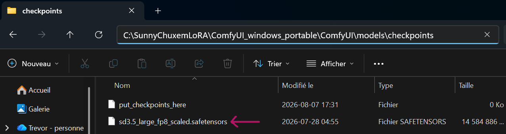
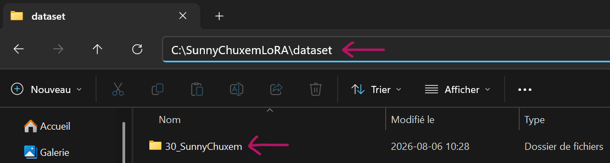
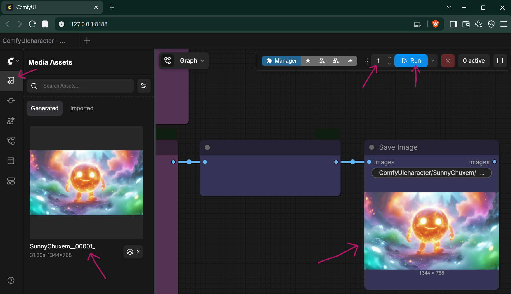

# 🌞 SunnyChuxemLoRA: 100% Commercially Usable Character LoRA v1.0.7


`SunnyChuxemLoRA` is a 100% Commercially Usable specialized character fine-tuning model architecture trained natively on **Stable Diffusion 3.5 Large** using an all-in-one local ComfyUI interface. Visit [Hugging Face](https://huggingface.co/Superklok/SunnyChuxemLoRA/blob/main/SunnyChuxemLoRA.safetensors) to download `SunnyChuxemLoRA` for FREE!

This LoRA reproduces the TrenchPetals Sunny Chuxem character; a bright living sun with tubular cartoon arms and legs. More information about this benchmarking character on [Toyhouse](https://toyhou.se/40566158.sunny-chuxem).

---

## 💵 The Ultimate Commercial Core
Unlike LoRAs and workflows tied to restrictive non-commercial licenses, **this entire architecture is 100% free for commercial use.** 

* **Indie Game Devs:** Generate Sunny Chuxem character images, custom character variations, and concept art locally.
* **Content Creators:** Automate Sunny Chuxem character image generation.
* **IP Creators:** Monetize your Sunny Chuxem character images, workflows, original character variations, and visual outputs with zero subscription overhead.

Sunny Chuxem was created with the help of `ComfyUIcharacter`, which specializes in turning primitive MS Paint drawings, combined with text prompts, into highly detailed 100% commercially usable images. Sunny Chuxem began as a primitive MS Paint drawing, here are the steps of his development using the `ComfyUIcharacter` workflow.

 ➡️ ⤵️
 ➡️ ⤵️
 ➡️ 

Visit [Upwork](https://www.upwork.com/freelancers/~01a2b86360ffeb733e)/[Contra](https://contra.com/Superklok) to get your copy of the `ComfyUIcharacter` 100% commercially usable character automation engine today!

---

## 📊 Model Technical Details
* **Base Architecture Compatibility:** Stable Diffusion 3.5 Large (fp8 scaled / fp16 / bf16)
* **Native Trained Resolution:** 1344x768 (Landscape centered-crop dataset layout)
* **Required Activation Token:** `SunnyChuxem`
* **Recommended Weight:** 0.8 - 1.0 (Use 1.0 for absolute character fidelity or dial down to 0.8 if stacking with heavy environment styles. Feel free to experiment with different values outside of the universal recommendation of 0.8 - 1.0 for character LoRAs, to see how it affects the final output image.)
* **Dataset Density:** 50 hand-selected character images at 30 processing iterations per file (3,000 total training steps).
* **Final loss value**: 0.0242, an absolute gold-standard score for a 50-image character model. It locked onto the Sunny Chuxem character details perfectly.

---

## 🚀 Native ComfyUI Training Architecture
This repository includes the official `ComfyUI Workflow - SunnyChuxemLoRA.json` workflow file. You can train this model locally entirely within ComfyUI without installing terminal command suites, command-line environments, or complex external dependencies.

---

## INSTALLATION GUIDE

## 🎨 Step-by-Step Setup: ComfyUI Automation Workflow

Follow these steps to configure the image-generation pipeline. This workflow is optimized to run on a single 16GB VRAM graphics card.

### Prerequisites
* An NVIDIA GPU with 16GB+ VRAM (Optimized for RTX 4070 Ti, 5070 Ti, or similar).
* The `SunnyChuxemLoRA\dataset\30_SunnyChuxem\` folder.
* The `ComfyUI Workflow - SunnyChuxemLoRA.json` workflow file included in the `SunnyChuxemLoRA\` folder.
* The `captioner.py` script in the `SunnyChuxemLoRA\` folder.

---

> ⚠️ **IMPORTANT NOTE:** Download the **SunnyChuxemLoRA** GitHub repository directly to the folder location where you intend to run your applications. **SunnyChuxemLoRA** is a fully portable and 100% offline-capable environment. All related application files, models, and caches live strictly inside the main installation folder. Once set up, you can completely disconnect your system from the internet without losing any functionality.

### Step 1: Install ComfyUI (Portable Windows Build)


1. You will first need to install Git for Windows from the official page (https://gitforwindows.org/). The direct download link is https://github.com/git-for-windows/git/releases/download/v2.55.0.windows.3/Git-2.55.0.3-64-bit.exe


2. Download the official **ComfyUI Windows Portable Build** from the ComfyUI Downloads Page (https://docs.comfy.org/installation/comfyui_portable_windows).


3. Extract the downloaded `ComfyUI_windows_portable_nvidia.7z` archive into your `SunnyChuxemLoRA\` folder, then go inside the resulting `ComfyUI_windows_portable_nvidia` folder and not the `.7z` archive.

4. Open the `SunnyChuxemLoRA\ComfyUI_windows_portable` folder. You will see several batch files, an `advanced` folder, a main `ComfyUI` folder, a `python_embeded` folder, and an `Update` folder.

> ⚠️ **NOTE:**Make sure the `ComfyUI_windows_portable_nvidia` folder contains all the ComfyUI files and is placed directly in the `SunnyChuxemLoRA\` folder.

---

### Step 2: Configure the VRAM-Optimized Startup Script

To prevent ComfyUI from locking your graphics card and crashing your local chatbot backend, modify the startup configurations:


1. Right-click the file named `run_nvidia_gpu.bat` and select **Edit** (or open it with Notepad).


2. Replace the entire default text line at the top of the file with the following optimized command:
   ```python
   .\python_embeded\python.exe -s ComfyUI\main.py --windows-standalone-build --fp8_e4m3fn-text-enc --use-pytorch-cross-attention
   ```
3. Save the `run_nvidia_gpu.bat` file and close your text editor. 

---

### Step 3: Download the ComfyUI Manager


1. Browse to your `SunnyChuxemLoRA\ComfyUI_windows_portable\ComfyUI\custom_nodes` folder and open a Command Prompt inside that folder by clicking in the **Address Bar** at the top, typing `cmd`, and pressing Enter. This will open a Command Prompt terminal in your `custom_nodes` folder.


2. Once the black box (Command Prompt) pops up, type the following into it and press Enter: 
   ```shell
   git clone https://github.com/ltdrdata/ComfyUI-Manager comfyui-manager
   ```
3. Close the Command Prompt terminal window once the download operation is complete.

---

### Step 4: Load the Automated Workflow & Dependencies 

 ➡️ 

1. Download `sd3.5_large_fp8_scaled.safetensors` from https://huggingface.co/Comfy-Org/stable-diffusion-3.5-fp8/blob/main/sd3.5_large_fp8_scaled.safetensors and place it in your `SunnyChuxemLoRA\ComfyUI_windows_portable\ComfyUI\models\checkpoints` folder.


2. Browse to your `SunnyChuxemLoRA\ComfyUI_windows_portable` folder and double-click your modified `run_nvidia_gpu.bat` file. A browser window will open automatically at `http://127.0.0.1:8188`. It may take a couple minutes to launch for the first time after installing ComfyUI.

3. Locate the `ComfyUI Workflow - SunnyChuxemLoRA.json` workflow file inside the `SunnyChuxemLoRA\` folder.

 ➡️ 

4. Drag and drop the `ComfyUI Workflow - SunnyChuxemLoRA.json` workflow file directly into the ComfyUI browser interface to load the automated pipeline.



5. Browse to your `SunnyChuxemLoRA\dataset` folder and copy the `30_SunnyChuxem` folder.


6. Paste the `30_SunnyChuxem` dataset into the `SunnyChuxemLoRA\ComfyUI_windows_portable\ComfyUI\input` folder.


7. Enter the number of LoRAs you would like to train sequentially, then press `Run` to train the amount of LoRAs you requested. Your trained LoRA files can be found in the `SunnyChuxemLoRA\ComfyUI_windows_portable\ComfyUI\output\models\loras` folder. 


When training your own LoRAs, you can use the `captioner.py` script found in your `SunnyChuxemLoRA\` folder to create `.txt` files to accompany each of your LoRA training images.


If you're interested in owning a custom version of the same Premium ComfyUI Workflow that generated the images used to train `SunnyChuxemLoRA`, then reach out through [Upwork](https://www.upwork.com/freelancers/~01a2b86360ffeb733e) or [Contra](https://contra.com/Superklok) to order your very own custom copy of the `ComfyUIcharacter` 100% Commercially Usable Character Automation Engine + SillyTavern Integration today! Here's a sample output from using the `SunnyChuxemLoRA` through the `ComfyUIcharacter` SillyTavern integration:

 


The `ComfyUIcharacter` workflow comes with 2 completely separate preloaded background text prompt placeholders for when it's not importing information from SillyTavern to generate images, by default you have the choice between generating your own 100% commercially usable images of Sunny Chuxem in a multi-colour alien world or a mysterious purple brick sewer. The system accepts a combination of different text prompts and uploaded image files to generate the final output image. This is an example of the multi-colour portrait prompt in the `ComfyUIcharacter` workflow:

 


Here's an example of the purple portrait prompt in the `ComfyUIcharacter` workflow:


Your 100% Commercially Usable LoRA training workflow is ready to go, and the parameters can easily be modified to train your own custom LoRAs!

---

# 🚀 TrenchPetals Sunny Chuxem — 100% Commercial Use AI & ComfyUI Benchmark

**TrenchPetals Sunny Chuxem** is a Superklok Labs production-grade character asset and LoRA purpose-built for benchmarking advanced ComfyUI workflows, custom nodes, and AI pipeline integrations. 

Unlike traditional assets, this character and its underlying intellectual property are released with **zero commercial restrictions**. You are fully authorized to use this asset in commercial video games, software applications, marketing campaigns, and creative projects completely free of charge.

---

## 🛠️ Need Custom ComfyUI Workflows or AI Pipelines?
While this character LoRA is completely free, achieving perfect consistency, hyper-speed rendering, and automated production pipelines requires specialized engineering. 

If you need a custom-built generation pipeline, bespoke character LoRAs for your brand, or optimized ComfyUI enterprise workflows, let's build it together!

**Hire me directly on your preferred freelance platform:**
* 💼 **Hire on [Upwork](https://www.upwork.com/freelancers/~01a2b86360ffeb733e)**
* ⚡ **Hire on [Contra](https://contra.com/Superklok)**
* 🌐 **Portfolio on [GitHub](https://github.com/Superklok)**

---

## 📊 Benchmark Capabilities
The TrenchPetals Sunny Chuxem character asset is explicitly engineered to test the limits of your generative pipelines:
* **High-Fidelity Consistency:** Perfect for testing seed stability, IP-Adapter configurations, and ControlNet weighting.
* **SFW / Production-Ready:** Clean, professional aesthetics suitable for corporate demos, game engine integrations, and open-source testing.
* **Architecture Agnostic:** Optimized for seamless integration across Stable Diffusion architectures and custom ComfyUI nodes.

---

## 📜 License & Commercial Use (Summary)

This repository is distributed under the **SUPERKLOK LABS UNIFIED PUBLIC ASSET LICENSE v1.0**. 

* **100% Free for Commercial Use**: You are fully permitted to use the ComfyUI workflows, LoRA models, and test images to generate commercial artwork.
* **Mandatory Attribution**: You must credit **Superklok Labs / TrenchPetals** by linking to or tagging one of the official handles (for example, [Twitter(X)](https://x.com/SuperklokLabs) or [Instagram](https://www.instagram.com/superkloklabs/)) whenever you publish content created or upscaled with these assets.

See the full [LICENSE](LICENSE) file for legal details and the complete list of attribution links.

---

💡 *If you find this project useful, reach out via [Upwork](https://www.upwork.com/freelancers/~01a2b86360ffeb733e)/[Contra](https://contra.com/Superklok) to scale up your AI infrastructure!*